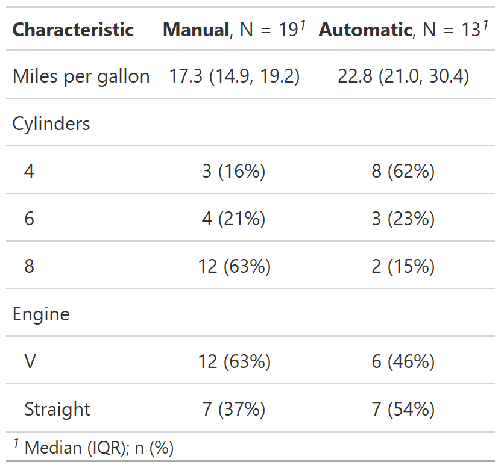

Make a baseline table
================
Author
13.5.2022

# Background

Epidemiologic and clinical research papers often describe the study
sample in a first, baseline table. Providing a baseline table is one of
the recommendations of the CONSORT (Moher et al. (2012)) and STROBE (von
Elm et al. (2007)) statements. If well-executed, it provides a rapid,
objective, and coherent grasp of the data and can illuminate potential
threats to internal and external validity (Hayes-Larson et al. (2019)).

# Main important considerations

Baseline tables can be presented in different ways, but certain features
are common and some recommendations need be followed. In the next
paragraph and figure we provide an overview of the main important
considerations, for more detailed review and guidelines see (e.g. Moher
et al. (2012), Hayes-Larson et al. (2019)).

Characteristics are generally presented on the left as rows and
groupings at the top as columns. Groups are defined by treatment
allocation for RCTs, disease status for case–control studies or
cohorts.If appropriated, the overall population’ characteristics may be
presented in a separate column. Characteristics should include of study
participants (e.g., demographic, clinical, social) and information on
exposures and potential data confounders. Inside each cell, descriptive
statistics are typically given as n (%) for categorical variables and
mean (standard deviation) or median (25th-75th percentile or
minimum-maximum) for continuous variables.The type of statistical
measurement used should be indicated (e.g., together with the
characteristic, in a footnote).The number of participants with missing
data should be reported for each variable of interest.

**Important note: in RCT’s, differences between randomized groups should
not be tested for statistical significance**. Indeed, some imbalance is
unavoidable owing to chance, especially if many characteristics are
considered (Palesch (2014))

<div class="figure">


<p class="caption">
Figure 1: Basic baseline structure and analysis-specific considerations
affecting columns, rows, and cells. Figure from (Hayes-Larson et al.
(2019))
</p>

</div>

# How to program a baseline table

Many developers have published tools for building baselines tables. When
choosing one please consider the flexibility of the tool. Indeed
requirements for the contents and formatting of baseline table may vary
depending on the project, the authors, the target journal… Here we
present few (very flexible) options for R and stata.

## In R

### Data

``` r
library(dplyr)
library(Hmisc)
data(mtcars)
mtcars$am_f <- factor(mtcars$am, 0:1, c("Manual", "Automatic")) 
mtcars$vs_f <- factor(mtcars$vs, 0:1, c("V", "Straight")) 
d <- mtcars %>%  select(mpg, cyl, am_f,vs_f)

Hmisc::label(d$mpg) <- "Miles per gallon"
Hmisc::label(d$cyl) <- "Cylinders"
Hmisc::label(d$am_f) <- "Transmission"
Hmisc::label(d$vs_f) <- "Engine"
```

### Using gtsummary

``` r
#Make a table stratify the table by transmission
library(gtsummary)
table1=d %>%  tbl_summary(by = am_f)
```



This is the basic usage; defaults options may be customized.

-   Variable types are automatically detected so that appropriate
    descriptive statistics are calculated.
-   Label attributes from the data set are automatically printed.
-   Missing values are listed as “Unknown” in the table.
-   Variable levels are indented and footnotes are added.

Once produced gtsummary tables can be converted your favorite format
(e.g. html/pdf/word). For more information see
[here](https://www.danieldsjoberg.com/gtsummary/articles/rmarkdown.html))

``` r
# declare cylinders as a continuous variable, for this variable calculate the mean and sd value, add an overall column, change the missing text
table1=d %>%
        tbl_summary(by = am_f, 
                    type = list(cyl ~ 'continuous'),
                    statistic = list(cyl ~ "{mean} ({sd})"),
                    missing_text = "Missing") %>%
        add_overall()
```


If needed groups may be compare using statistical tests

``` r
table1=d %>%
        tbl_summary(by = am_f, 
                    type = list(cyl ~ 'continuous'),
                    statistic = list(cyl ~ "{mean} ({sd})"),
                    missing_text = "Missing") %>%
        add_overall()%>%
        add_p()
```


As before the function detects variable type and uses an appropriate
statistical test. If needed defaults may be customized.

#### Additional information

For more detailed tutorial and additional options see the very complete
[vignette](https://www.danieldsjoberg.com/gtsummary/articles/tbl_summary.html)
and [website](https://www.danieldsjoberg.com/gtsummary/index.html)

### Using atable

``` r
library(atable)
table1=atable(d,
       target_cols = c("mpg" , "cyl" , "vs_f"),
       group_col = "am_f",
       format_to="Word")
```

or similar using the formula interface

``` r
table1=atable(mpg+cyl+ vs_f ~ am_f, d,
              format_to="Word")
table1
```


The table may also be splitted in strata. For example we can decide to
present separately the characteristics of car with a “V” or a “Straight”
engine.

``` r
table1=atable(mpg+cyl  ~ am_f|vs_f , d,
              format_to="Word")
table1
```


As gtsummary, atable may be exported in different format (e.g. LATEX,
HTML, Word) and it is intended that some parts of atable can be altered
by the user. Hence the type variable,descriptive statistics, used
statistical tests may defined otherwise (for more details see Ströbel
(2019) as well as the package
[vignette](https://cran.r-project.org/web/packages/atable/vignettes/atable_usage.pdf).An
other informative vignette can be found by typing the foloowing command
in R:

``` r
vignette("modifying", package = "atable")
```

# Stata: btable

The table is constructed in a two-step approach using two functions:
btable produces an unformatted, raw table, which is then formatted by
btable\_format to produce a final, publication-ready table. By default,
the raw table contains all summary measures, and—if there are two
groups—effect measures and p-values. Optionally, the table can be
restricted to effect measures of choice and a number of alternative
calculations for confidence intervals are available.

## Instalation

``` r
#In order to install btable from github the github-package is required:
net install github, from("https://haghish.github.io/github/")
#You can then install the development version of btable with:
github install CTU-Bern/btable
```

## Example

``` r
# load example dataset
sysuse auto2

# generate table
btable price mpg rep78 headroom, by(foreign) saving("excars") denom(nonmiss)

# format table (default formatting)
btable_format using "excars", clear
```


The formatting option can be modified. For example we can decide we may
want to

-   present the median and lower and upper quartiles instead of the mean
    and standard deviation
-   remove the overall column, the effect measure, and the information
    column

``` r
#If we want to display median [lq, up] for all the continuous variables
btable_format using "excars", clear descriptive(conti median [lq, uq]) drop(total effect info)

#If we want to display mean (sd) for the mpg variable and median [lq, up] for all the other continuous variables
btable_format using "excars", clear desc(conti median [lq, uq] mpg mean (sd)) drop(total effect info)
```


# References

<div id="refs" class="references csl-bib-body hanging-indent">

<div id="ref-HAYESLARSON2019125" class="csl-entry">

Hayes-Larson, Eleanor, Katrina L. Kezios, Stephen J. Mooney, and Gina
Lovasi. 2019. “Who Is in This Study, Anyway? Guidelines for a Useful
Table 1.” *Journal of Clinical Epidemiology* 114: 125–32.
https://doi.org/<https://doi.org/10.1016/j.jclinepi.2019.06.011>.

</div>

<div id="ref-MOHER201228" class="csl-entry">

Moher, David, Sally Hopewell, Kenneth F. Schulz, Victor Montori, Peter
C. Gøtzsche, P. J. Devereaux, Diana Elbourne, Matthias Egger, and
Douglas G. Altman. 2012. “CONSORT 2010 Explanation and Elaboration:
Updated Guidelines for Reporting Parallel Group Randomised Trials.”
*International Journal of Surgery* 10 (1): 28–55.
https://doi.org/<https://doi.org/10.1016/j.ijsu.2011.10.001>.

</div>

<div id="ref-Palesch" class="csl-entry">

Palesch, Yuko Y. 2014. “Some Common Misperceptions about
&lt;i&gt;p&lt;/i&gt; Values.” *Stroke* 45 (12): e244–46.
<https://doi.org/10.1161/STROKEAHA.114.006138>.

</div>

<div id="ref-Strbel2019atableCT" class="csl-entry">

Ströbel, Armin Michael. 2019. “Atable: Create Tables for Clinical Trial
Reports.” *R J.* 11: 137.

</div>

<div id="ref-VONELM20071453" class="csl-entry">

von Elm, Erik, Douglas G Altman, Matthias Egger, Stuart J Pocock, Peter
C Gøtzsche, and Jan P Vandenbroucke. 2007. “The Strengthening the
Reporting of Observational Studies in Epidemiology (STROBE) Statement:
Guidelines for Reporting Observational Studies.” *The Lancet* 370
(9596): 1453–57.
https://doi.org/<https://doi.org/10.1016/S0140-6736(07)61602-X>.

</div>

</div>
